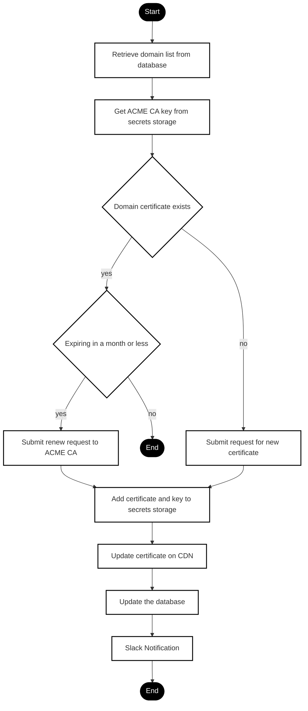
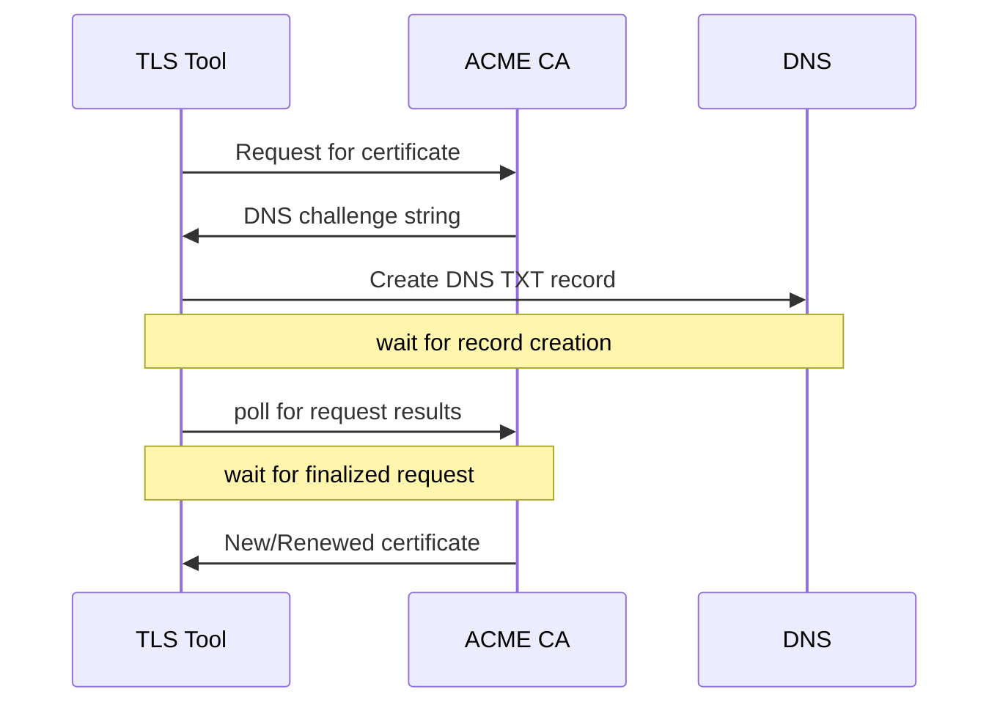

[](https://www.python.org/downloads/)
[](https://opensource.org/licenses/Apache-2.0)
[](CODE_OF_CONDUCT.md)

# Table of Contents

- [Acknowledgements](#acknowledgements)
- [Quickstart](#quickstart)
- [How the tool works (high level)](#how-the-tool-works-high-level)
- [Requirements](#requirements)
    - [Database](#database)
    - [Let’s Encrypt](#lets-encrypt)
    - [AWS account](#aws-account)
    - [Fastly account](#fastly-account)
    - [Infrastructure](#infrastructure)
- [Configuration settings](#configuration-settings)
- [Plugins](#plugins)
- [Endpoints](#endpoints)
- [Cron tasks](#cron-tasks)
- [Additional documentation](#additional-documentation)
- [Testing](#testing)
- [Roadmap](#roadmap)
- [License + Contributing](#license--contributing)


# AutoTLS

AutoTLS is a tool that automates TLS requests to ensure that owned domains are protected by TLS certificates issued by Lets Encrypt and hosted at Fastly. AutoTLS can generate new certificates and maintain those certificates with automatic renewals.

Why this is cool: 
- If you have a lot of domains, SAN certificates are an option for managing them in one place, but that can be expensive and hard to modify if you need changes.
- Generating individual long-term certificates for each domain can get expensive.
- Let's Encrypt certificates are free, but they are only valid for a period of three months, so they need regular renewal.

AutoTLS manages that renewal cycle.

AutoTLS can be used by anyone who owns at least one domain, uses that domain to host content, and doesn't want to have to think about periodically renewing certificates.

At a high level, AutoTLS is a Flask application that automates:
- certificate requests to a CA (currently, that is only Let's Encrypt)
- DNS validation through a registrar (currently, only AWS Route53, but more vendor plugins are on the roadmap)
- Certificate storage with Fastly's Platform TLS service

This is a standalone application - to use it, create your own fork, get all your vendor requirements in place, populate the settings, and then start it up.

> [!NOTE]
> This project is not for beginners. Flask experience will be helpful, as will some familiarity with data stores and cloud infrastructure.


# Acknowledgements

Authors/key contributors to this code include:

[Barbara Shaurette](https://github.com/mechanicalgirl), Senior Site Reliability Engineer, Vox Media

[Jose Eufrasio](https://github.com/coredump), Site Reliability Engineer, Adyen (former Senior SRE at Vox Media)


# Quickstart

Fork and then clone the fork to your local environment:

```
git clone git@github.com:your-fork.git
```

Run this once, to create a virtual environment:

```
python -m venv .venv
```

Load the virtual environment

```
source .venv/bin/activate
```

Install package requirements

```
python -m pip install -e .
```

> [!NOTE]
> If you run into errors with the `psycopg2` build, you may need to rebuild your venv with Python 3.9 (install using Homebrew (`brew install python@3.9`) or pyenv):
```
python3.9 -m venv venv
source venv/bin/activate
python -m pip install -e .
```

Copy `.env.example` into `.env` and populate your local settings values (see the [Requirements](#requirements) and [Configuration settings](#configuration-settings) sections below)

```
cp .env.example .env
```

Start up the application:

```
gunicorn --worker-class gevent --bind 0.0.0.0:8000 wsgi:app
```

If all of your .env values are valid and the application starts up, you can now open a second terminal window and execute a curl call against:

```
curl http://localhost:8000/process?testmode=test -H "Flask-Key: FLASK_SECRET_KEY"
```

Note: In a local or staging environment, the tool will not load certificates to Fastly, but still executes requests against:
- your database
- Let's Encrypt
- your registrar
- your secrets storage provider

> **WARNING**: This will run against the database, registrar, and secrets storage you have configured in your .env, so plan accordingly and test carefully.


# How the tool works (high level)

This tool is divided into four specific parts:

- An `orchestrator` module that handles incoming requests and directs the application flow
- A `domains` module that connects to the data store and searches for domains that are eligible for new certificates based on current TLS expiration dates and other metadata
- A `certificates` module that manages the certificate request and validation process
- A `storage` module that saves key values to a storage provider and uploads the certificate components to Fastly's Platform TLS service.

This is a simplified chart of the main application flow:



To be eligible for generating a certificate, each domain must have a record in the database with the following values:

- `owned` != false
- `status` NOT IN ('Parked', 'Expired')
- `zone_id` != ''
- `tls_issuer` != 'Lets Encrypt' OR `tls_issuer` = 'Lets Encrypt' AND `tls_exp_date` expires within RENEWAL_WINDOW_DAYS

Each domain must also have DNS records set to a Fastly TLS configuration map (see Requirements).

Following best practices suggested by *Lets Encrypt*, domains can be renewed about a month before their expiration dates are up. The `RENEWAL_WINDOW_DAYS` setting (currently defaulting to 15) sets the interval at which domains are considered ready for certificate renewal (in other words, 15 days before the expiration of the domain's current certificate).

If those conditions are satisfied, new (or renewed) certificates should be generated and added to Fastly on a request to the `/process` endpoint.

For each domain being processed, the application checks for the certificate's *existence* and *expiration* directly, talking to the server via TLS port (443) and decoding the certificate. This ensures that the results are exactly what clients/browsers will be seeing, and protects from any drift that can be caused by caching.

The transactions used to resolve a [**DNS-01**](https://letsencrypt.org/docs/challenge-types/#dns-01-challenge) type challenge from Lets Encrypt involve an exchange of information between this tool, ACME, and a DNS provider/registrar. The request for a certificate uses a Lets Encrypt account key, retrieved from secrets storage.

Once certificate/secret key pairs come back from *Lets Encrypt*, they are stored in secrets storage as a backup. Those certificates are then uploaded to Fastly's bulk TLS service via API requests.

> [!NOTE]
> For information about the bulk TLS service, see the [Fastly documentation](https://www.fastly.com/documentation/reference/api/tls/platform/)

Afterwards, the database is updated with metadata from the newly generated certificate.

Note: Once uploaded, TLS certificates will not be visible in the Fastly console - they can only be reached via an API call. You can list all of your current certificates using [Fastly's `TlsBulkCertificatesApi` client](https://github.com/fastly/fastly-py/blob/main/docs/TlsBulkCertificatesApi.md), with a call to list_tls_bulk_certs().


## Certificates request - detailed order of operations



1. Instantiate the acme client and connect to Let's Encrypt

2. Generate a private key and certificate signing request (CSR), passing both 'domain' and '*.domain'

3. Use the CSR to get an order object via the acme client

4. Parse out DNS01 challenges from the order object and return a list of valid challenge tokens

5. Decode each challenge token, then recombine the tokens into a list where each item contains the original and converted tokens

6. Use those validation tokens to perform DNS challenges - write TXT records containing the tokens to the domain's DNS zone, then send a request to Lets Encrypt to verify that the TXT record exists and has the correct value.

7. Once the challenge is finalized, Lets Encrypt will return a PEM-encoded full-chain certificate, including a the csr and private key, which are saved to secrets storage.


# Requirements


## Database

This project uses SQLAlchemy models, but it does **not** ship with an opinionated database engine or initialization helper. The right choice of database backend and initialization process depends heavily on your own infrastructure and deployment preferences.  

You’ll need to decide:  
- Which database engine to use (PostgreSQL, MySQL, SQLite, etc.).  
- How and where to host it (local dev, containerized, cloud service, managed DB, etc.).  
- How to initialize the database schema from the models defined in this repository.  

For reference, here are some resources that may help you get started:  
- [Flask SQLAlchemy — Quickstart](https://flask-sqlalchemy.palletsprojects.com/en/latest/quickstart/)  
- [SQLAlchemy — Creating and Dropping Tables](https://docs.sqlalchemy.org/en/latest/core/metadata.html#creating-and-dropping-database-tables)  
- [SQLAlchemy Dialects](https://docs.sqlalchemy.org/en/latest/dialects/)  

> *Tip:* If you’re experimenting locally, SQLite is a simple option for testing with minimal setup. For production, we recommend using a managed database service appropriate to your infrastructure.  

**Local testing with SQLite:**  

If you’d like to experiment without setting up a full database engine, you can use SQLite.  

1. Make sure your FLASK_APP value is set, and set an absolute path for your database file:

```bash
export FLASK_APP=tlstool
export SQLALCHEMY_DATABASE_URI="sqlite:////$PWD/instance/tlstool.db"
```

2. Run the provided Flask CLI command to create the schema:

```bash
flask init-db
```

Use `flask init-db --drop-first` if you want to drop and recreate all tables.  

For production deployments, we recommend configuring a proper database backend (e.g. PostgreSQL, MySQL).

The data store is the source that AutoTLS relies on for information about each domain's validity, ownership, and certificate status. For information on data requirements for your domain records, see [How the tool works (high level)](#how-the-tool-works-high-level) and table definitions in [tlstool/models.py](tlstool/models.py).


## Let’s Encrypt account

Let’s Encrypt is a certificate authority that provides free SSL certificates for public websites. To use an ACME command line tool to request certificates manually, you do not need to have a Let's Encrypt aaccount, but you will need one to use this tool. For details on how to generate an account key manually, see [LETSENCRYPT.md](LETSENCRYPT.md).

## AWS account

In future releases, the tool will have plugins written for other registrars and secrets storage providers, but for now AWS is the only provider configured for both of those services. AWS is currently used for:

- Route53 - hosted zones for domain DNS

- Secrets Manager - for storing Lets Encrypt account key and issued certificates

## Fastly account

This tool utilizes Fastly's bulk TLS service, which assumes that your domains and their certificates will be served through Fastly. For more information on getting set up, see the [Fastly documentation](https://www.fastly.com/documentation/).

For each domain that you plan to process through this tool, you will need to have the following DNS records set:

- `CNAME` record pointing at one of Fastly's TLS configuration maps, e.g.: `vmtls-np.map.fastly.net`

- `A` record pointing at the corresponding Fastly IP addresses, e.g. `199.232.193.246 199.232.197.246`

The bulk TLS endpoints used will require authentication with an API token with at least TLS management permissions. That token can be created via your Fastly account console or with an API request. For details, see the Fastly documentation on [using API tokens](https://www.fastly.com/documentation/guides/account-info/account-management/using-api-tokens/) and [Configuring user roles and permissions](https://www.fastly.com/documentation/guides/account-info/user-access-and-control/configuring-user-roles-and-permissions/).


## Infrastructure

This project does **not** prescribe a specific infrastructure or deployment method. You are free to choose the environment that best fits your needs and expertise.  

You’ll need to decide:  
- Where to host and run the application (VM/server, Kubernetes cluster, container platform, PaaS, etc.).  
- How to package and deploy it (Docker, system service, cloud build pipeline, etc.).  
- How to configure environment variables for your chosen environment.  

At minimum, your infrastructure must support:  
- Inbound HTTPS (to expose the application’s processing endpoint).  
- Outbound HTTPS (to communicate with Let’s Encrypt, Fastly, and your chosen DNS/secrets providers).  

Use the stack you are most comfortable with — whether that’s a simple server instance, a Kubernetes namespace, or something else entirely. This flexibility is by design.  


# Configuration settings

This project uses environment variables for configuration. These can be set directly in your shell, via a `.env` file, or through your deployment platform’s secret management system.

All required environment variables can be found in the .env.example file. Most should be self-explanatory - common Flask settings, database connection components, etc.

Some settings that may be unfamiliar:

#### `FASTLY_TLS_CONFIGURATION_ID`

In order to use Fastly to serve certificates, you will need to have CNAME and A records pointing at a Fastly TLS configuration map (see above, under "Fastly account"). That configuration map will have a unique alphanumeric id which must be set in order to complete bulk TLS API requests.

#### `LE_DIRECTORY_URL`

This endpoint determines where Lets Encrypt requests will be directed. The default is a staging endpoint that can be used for testing. When ready to switch to production, change this value to `LE_DIRECTORY_URL=https://acme-v02.api.letsencrypt.org/directory`.

#### Slack settings:

- **`ENABLE_SLACK_NOTIFICATIONS`
- **`SLACK_WEBHOOK_KEY`
- **`SLACK_WORKSPACE_ID`
- **`SLACK_BOT_TOKEN`

One of the features available with this application is a Slack notification on completion of the certificate request flow. To utilize this feature, you will need to have a purpose-built Slack app that communicates with your workspace and selected channel. The `SLACK_WEBHOOK_KEY`, `SLACK_WORKSPACE_ID`, and `SLACK_BOT_TOKEN` are all generated during the process of setting up the Slack app. `ENABLE_SLACK_NOTIFICATIONS` is set to `False` by default; without Slack notifications, all notices will be sent to the application logs instead.

#### `PEM_SECRET_BASE_PATH`

Before uploading to Fastly, certificates are stored as secrets (to provide a backup). This variable sets the base path for that secret's name. The base path is combined with a domain name and PEM type (private_key or fullchain):

f"{PEM_SECRET_BASE_PATH}/{domain}/{pem['key']}

For example, with a base path set to `pem-secret-`, these secret names would be generated for the domain `example.com`:

```
pem-secret/example.com/private_key
pem-secret/example.com/fullchain	
```

#### `RENEWAL_WINDOW_DAYS`

Currently defaulting to 15, this value sets the interval at which domains are considered ready for certificate renewal (in other words, 15 days before the expiration of the domain's current certificate).

#### Notes on database settings

Most settings are self-explanatory, but a few related to database configuration deserve clarification:  

- **`DBNAME`, `DBHOST`, `DBUSER`, `DBPWD`** — Convenience variables for building a database URI. These are optional; if all are provided, they are combined into `SQLALCHEMY_DATABASE_URI`.  
- **`SQLALCHEMY_DATABASE_URI`** — Can be set directly instead of using the `DB*` vars.  
- **`SQLALCHEMY_TRACK_MODIFICATIONS`** — Boolean (default: `False`), controls SQLAlchemy’s modification tracking feature.  

For local development you can ignore these entirely and use SQLite, but for production you’ll want to configure an appropriate database URI. See [Database Initialization](#database) for more details.  


# Plugins

This application is designed to utilize Lets Encrypt for requesting TLS certificates and Fastly for hosting them, but some other components are built as plugins and will eventually be able to employ other vendors.

- DNS Management: Handles interactions with zone files and DNS records for the purposes of DNS validation.

    The base class for DNS management is `DNSBase`. Currently, the only extension of this class is AWSRoute53, but future releases could add extensions for other registrars with API-enabled DNS management, such as GoDaddy, Cloudflare or Porkbun.

- Secrets Management: Storage of keys and tokens required to communicate with APIs, and to store backups of the certificate/secret key pairs that come back from Lets Encrypt. Some kind of secrets storage is currently required, but may be made optional in a future release.

    The base class for secrets management is `SecretsBase`. Currently, the only extension of this class is AWSSecretsManager, but future releases could add extensions for other secrets storage managers, such as Hashicorp's Vault or Google Cloud Secret Manager.

Are you interested in writing a new plugin for either of these services? Take a look at our [contributing doc](CONTRIBUTING.md) and our [road map](ROADMAP.md)!


# Endpoints

To generate a certificate for just one domain:

```
curl https://your.host/single/example.com -H 'Flask-Key: FLASK_SECRET_KEY'
```

To generate/renew certificates for any eligible domain:

```
curl http://your.host/process?testmode=test -H "Flask-Key: FLASK_SECRET_KEY"
```

Test version of the main process flow (generates a certificate, writes DNS records, but does not upload to Fastly):

```
curl http://your.host/process?testmode=test -H "Flask-Key: FLASK_SECRET_KEY"
```


# Cron tasks

Cron tasks are the magic that makes this application something you can "set and forget", knowing your certificates are being monitored and renewed on a regular schedule.

Deploy the application to your server environment and run it with `gunicorn`:

```
gunicorn --worker-class gevent --bind 0.0.0.0:8000 --access-logfile - --error-logfile - --log-level info wsgi:app
```

Then enable a cronjob that kicks off the processing flow with a curl call. In this example crontab entry, the processing flow is called every 8 hours:

```
0 */8 * * *  /usr/bin/curl -s -i http://your.host/process -H "Flask-Key: FLASK_SECRET_KEY"
```


# Additional documentation

A complete overview of all methods and classes (based on docstrings) can be found at [/documentation](/documentation). To view these docs in a browser, run:

```
mkdocs serve          # live preview at http://127.0.0.1:8000
```


# Testing

See [TESTING.md](TESTING.md)


# Roadmap

See [ROADMAP.md](ROADMAP.md)


# License + Contributing

See [CONTRIBUTING.md](CONTRIBUTING.md)
